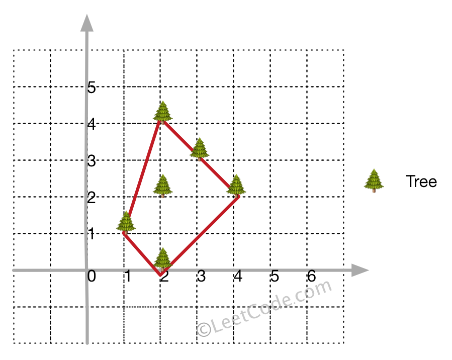
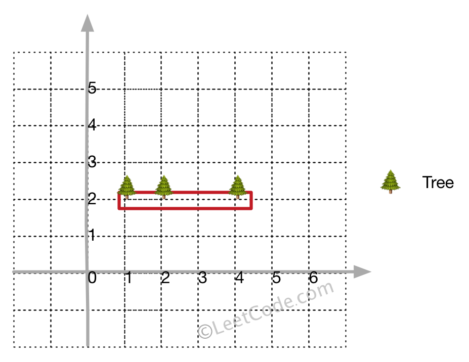

# 587. 安装栅栏
## 题目描述
在一个二维的花园中，有一些用 (x, y) 坐标表示的树。由于安装费用十分昂贵，你的任务是先用最短的绳子围起所有的树。只有当所有的树都被绳子包围时，花园才能围好栅栏。你需要找到正好位于栅栏边界上的树的坐标。


```
示例 1:

输入: [[1,1],[2,2],[2,0],[2,4],[3,3],[4,2]]
输出: [[1,1],[2,0],[4,2],[3,3],[2,4]]
解释: 见图1

示例 2:

输入: [[1,2],[2,2],[4,2]]
输出: [[1,2],[2,2],[4,2]]
解释: 见图2

即使树都在一条直线上，你也需要先用绳子包围它们。
```

注意:

- 所有的树应当被围在一起。你不能剪断绳子来包围树或者把树分成一组以上。
- 输入的整数在 0 到 100 之间。
- 花园至少有一棵树。
- 所有树的坐标都是不同的。
- 输入的点没有顺序。输出顺序也没有要求。

## 解题思路
- Andrew算法

    -- 向量叉积：向量pq和向量qr的叉积可以判别，qr相对于pq的方向，大于0在向量pq的左侧，小于0，在向量pq的右侧

    

    排序，x从小到大排序，x相等的情况，按y从小到大排序;最左边的点一定属于外边界（不然其他点围不住它);

    -- 左到右：按照数组顺序逐渐添加新的点，选择的倒数第二个点为p,倒数第一个点为q,现在的点为r;
    假设使用向量叉积可以判别r在pq右侧，则可放弃q,使用pr;**若在左侧或同向则直接加入数组**

    -- 右到左：按照数组顺序逐渐添加新的点，一选择的倒数第二个点为p,倒数第一个点为q,现在的点为r,不断判别r是否在pq右侧，从而选择是否放弃q的过程;需要判别是否已访问，已访问点不要重复访问;遍历过程必须加入最左侧点，因为需要删除右到左的凹下去的形状，回到最左侧可以删掉部分多余的点;最终结果需要排除掉最左侧点，因为头尾写了两次


```cpp
class Solution {
private:
    int cross(vector<int>& p, vector<int>& q, vector<int>& r){
        return (q[0]-p[0])*(r[1]-q[1])-(q[1]-p[1])*(r[0]-q[0]);
    }

    static bool cmp(vector<int> v1, vector<int>v2) {
        if(v1[0] == v2[0]) {
            return v1[1] < v2[1];
        } else {
            return v1[0] < v2[0];
        }
    }

public:
    vector<vector<int>> outerTrees(vector<vector<int>>& trees) {
        sort(trees.begin(), trees.end(), cmp);
        int n = trees.size();
        if(n < 4) return trees;
        vector<int> s;
        vector<bool> used(n, false);
        s.emplace_back(0);
        for(int i = 1; i < n; ++i) {
            while(s.size() >= 2 && cross(trees[s[s.size()-2]], trees[s[s.size()-1]], trees[i]) < 0) {
                used[s.back()] = false;
                s.pop_back();
            } 
            s.emplace_back(i);
            used[i] = true;
        }
        int nowSize = s.size();
        for(int i = n-2; i >= 0; --i) {
            if(!used[i]) {
                while(s.size() > nowSize && cross(trees[s[s.size()-2]], trees[s[s.size()-1]], trees[i]) < 0) {
                    s.pop_back();
                }
                s.emplace_back(i);
            }
        }
        s.pop_back();
        vector<vector<int>> result;
        for(int i = 0; i < s.size(); ++i) {
            result.emplace_back(trees[s[i]]);
        }
        return result;
    }
};
```
