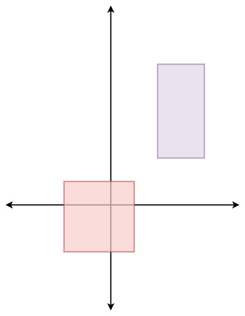

# 497. 非重叠矩形中的随机点

## 题目描述

给定一个由非重叠的轴对齐矩形的数组 rects ，其中 rects[i] = [ai, bi, xi, yi] 表示 (ai, bi) 是第 i 个矩形的左下角点，(xi, yi) 是第 i 个矩形的右上角点。设计一个算法来随机挑选一个被某一矩形覆盖的整数点。矩形周长上的点也算做是被矩形覆盖。所有满足要求的点必须等概率被返回。

在给定的矩形覆盖的空间内的任何整数点都有可能被返回。

请注意  ，整数点是具有整数坐标的点。

实现  Solution  类:

Solution(int[][] rects)  用给定的矩形数组  rects 初始化对象。
int[] pick()  返回一个随机的整数点 [u, v] 在给定的矩形所覆盖的空间内。



```
示例 1：
输入:
["Solution", "pick", "pick", "pick", "pick", "pick"]
[[[[-2, -2, 1, 1], [2, 2, 4, 6]]], [], [], [], [], []]
输出:
[null, [1, -2], [1, -1], [-1, -2], [-2, -2], [0, 0]]

解释：
Solution solution = new Solution([[-2, -2, 1, 1], [2, 2, 4, 6]]);
solution.pick(); // 返回 [1, -2]
solution.pick(); // 返回 [1, -1]
solution.pick(); // 返回 [-1, -2]
solution.pick(); // 返回 [-2, -2]
solution.pick(); // 返回 [0, 0]
```

提示：

$1 <= rects.length <= 100$
$rects[i].length == 4$
$-10^9 <= ai < xi <= 10^9$
$-10^9 <= bi < yi <= 10^9$
$xi - ai <= 2000$
$yi - bi <= 2000$
所有的矩形不重叠。
pick 最多被调用  $10^4$  次。

## 解题思路

### 前缀和+二分查找

- 使用前缀和记录前面所有矩形的总面积和，在取完随机面积后，对总面积取模，通过二分查找找到该值对应的矩形位置，根据随机面积在该矩形中取到相应的点

```cpp
class Solution {
public:
    Solution(vector<vector<int>>& rects) {
        classRects.assign(rects.begin(), rects.end());
        for(auto rect : rects) {
            int nowArea = (rect[2] - rect[0] + 1) * (rect[3] - rect[1] + 1);
            sum += nowArea;
            pointCount.emplace_back(sum);
        }
    }

    vector<int> pick() {
        int sumArea = pointCount.back();
        int randArea = rand() % sumArea;
        auto pos = upper_bound(pointCount.begin(), pointCount.end(), randArea);
        int index = pos - pointCount.begin();
        auto preArea = prev(pos);
        int innerPos = 0;
        if(index != 0) innerPos = randArea - *preArea;
        else innerPos = randArea;
        int rowLength = classRects[index][2] - classRects[index][0] + 1;
        int row = innerPos / rowLength;
        int col = innerPos % rowLength;
        return vector<int>{classRects[index][0] + col, classRects[index][1] + row};
    }
private:
    long sum = 0;
    vector<vector<int>> classRects;
    vector<int> pointCount;
};

/**
 * Your Solution object will be instantiated and called as such:
 * Solution* obj = new Solution(rects);
 * vector<int> param_1 = obj->pick();
 */
```
