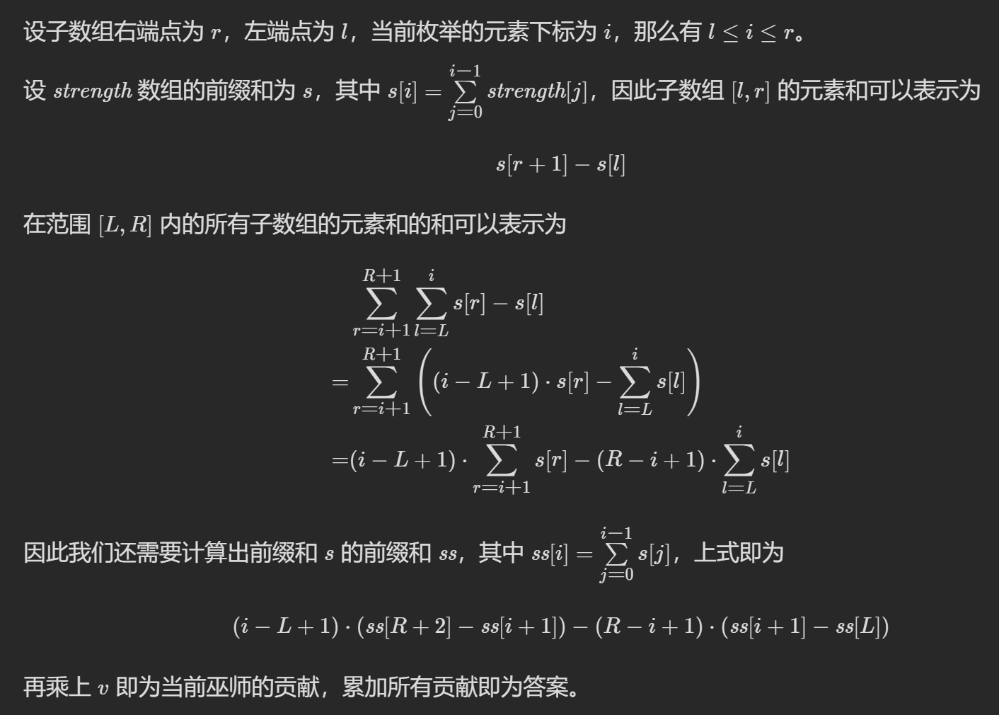

# 6077. 巫师的总力量和

## 题目描述

作为国王的统治者，你有一支巫师军队听你指挥。

给你一个下标从 0  开始的整数数组  strength ，其中  strength[i]  表示第  i  位巫师的力量值。对于连续的一组巫师（也就是这些巫师的力量值是  strength  的   子数组），总力量   定义为以下两个值的   乘积  ：

巫师中 最弱   的能力值。
组中所有巫师的个人力量值 之和  。
请你返回 所有   巫师组的 总   力量之和。由于答案可能很大，请将答案对  109 + 7  取余   后返回。

子数组   是一个数组里 非空   连续子序列。

```
示例 1：
输入：strength = [1,3,1,2]
输出：44
解释：以下是所有连续巫师组：
- [1,3,1,2] 中 [1] ，总力量值为 min([1]) * sum([1]) = 1 * 1 = 1
- [1,3,1,2] 中 [3] ，总力量值为 min([3]) * sum([3]) = 3 * 3 = 9
- [1,3,1,2] 中 [1] ，总力量值为 min([1]) * sum([1]) = 1 * 1 = 1
- [1,3,1,2] 中 [2] ，总力量值为 min([2]) * sum([2]) = 2 * 2 = 4
- [1,3,1,2] 中 [1,3] ，总力量值为 min([1,3]) * sum([1,3]) = 1 * 4 = 4
- [1,3,1,2] 中 [3,1] ，总力量值为 min([3,1]) * sum([3,1]) = 1 * 4 = 4
- [1,3,1,2] 中 [1,2] ，总力量值为 min([1,2]) * sum([1,2]) = 1 * 3 = 3
- [1,3,1,2] 中 [1,3,1] ，总力量值为 min([1,3,1]) * sum([1,3,1]) = 1 * 5 = 5
- [1,3,1,2] 中 [3,1,2] ，总力量值为 min([3,1,2]) * sum([3,1,2]) = 1 * 6 = 6
- [1,3,1,2] 中 [1,3,1,2] ，总力量值为 min([1,3,1,2]) * sum([1,3,1,2]) = 1 * 7 = 7
所有力量值之和为 1 + 9 + 1 + 4 + 4 + 4 + 3 + 5 + 6 + 7 = 44 。

示例 2：
输入：strength = [5,4,6]
输出：213
解释：以下是所有连续巫师组：
- [5,4,6] 中 [5] ，总力量值为 min([5]) * sum([5]) = 5 * 5 = 25
- [5,4,6] 中 [4] ，总力量值为 min([4]) * sum([4]) = 4 * 4 = 16
- [5,4,6] 中 [6] ，总力量值为 min([6]) * sum([6]) = 6 * 6 = 36
- [5,4,6] 中 [5,4] ，总力量值为 min([5,4]) * sum([5,4]) = 4 * 9 = 36
- [5,4,6] 中 [4,6] ，总力量值为 min([4,6]) * sum([4,6]) = 4 * 10 = 40
- [5,4,6] 中 [5,4,6] ，总力量值为 min([5,4,6]) * sum([5,4,6]) = 4 * 15 = 60
所有力量值之和为 25 + 16 + 36 + 36 + 40 + 60 = 213 。
```

提示：

$1 <= strength.length <= 10^5$
$1 <= strength[i] <= 10^9$

## 解题思路

### 单调栈+前缀和

- 通过单调栈求出 strength[i]为最小值的区间，在求左右区间时注意需要将一遍设置为小于等于，防止区间重叠，以示例 1 中的数组 [1,3,1,2]为例，如果左右两侧都是找严格小于，那么第一个 1 和第二个 1 算出来的边界范围都是一样的（都是整个数组），这就重复统计了，为了避免这种情况，可以把某一侧改为小于等于，比如把右侧改成小于等于，那么第一个 1 算出来的右边界不会触及或越过第二个 1，这样就能避免重复统计同一个子数组，求出来的区间为两边闭区间。
- 然后通过前缀和求出在前面过程中求出的区间内包含 strength[i]的所有子数组的和：
  
  s[i+1]为 strength[0-i]的和
  ss[i+2]为 strength[0-i]的和

```cpp
class Solution {
public:
    int totalStrength(vector<int>& strength) {
        int n = strength.size();
        vector<int> left = vector<int>(n, -1); // 左侧第一个小于当前值的位置
        vector<int> right = vector<int>(n, n); // 右侧第一个小于等于当前值的位置
        stack<int> s;
        for(auto i = 0; i < n; ++i) {
            while(!s.empty() && strength[i] <= strength[s.top()]) {
                right[s.top()] = i;
                s.pop();
            }
            if(!s.empty()) left[i] = s.top();
            s.push(i);
        }
        int mod = 1e9+7;
        vector<int> preSum(n+2, 0); //记录前缀和的前缀和
        long sum = 0;
        for(auto i = 1; i <= n; ++i) {
            sum += strength[i-1];
            preSum[i + 1] = (preSum[i] + sum) % mod;
        }

        int ans = 0;
        for (int i = 0; i < n; ++i) {
            long l = left[i] + 1, r = right[i] - 1; // [l,r] 左闭右闭
            long tot = ((i - l + 1) * (preSum[r + 2] - preSum[i + 1]) - (r - i + 1) * (preSum[i + 1] - preSum[l])) % mod;
            ans = (ans + strength[i] * tot) % mod; // 累加贡献
        }
        return (ans + mod) % mod; // 防止算出负数（因为上面算 tot 有个减法）
    }
};
```
